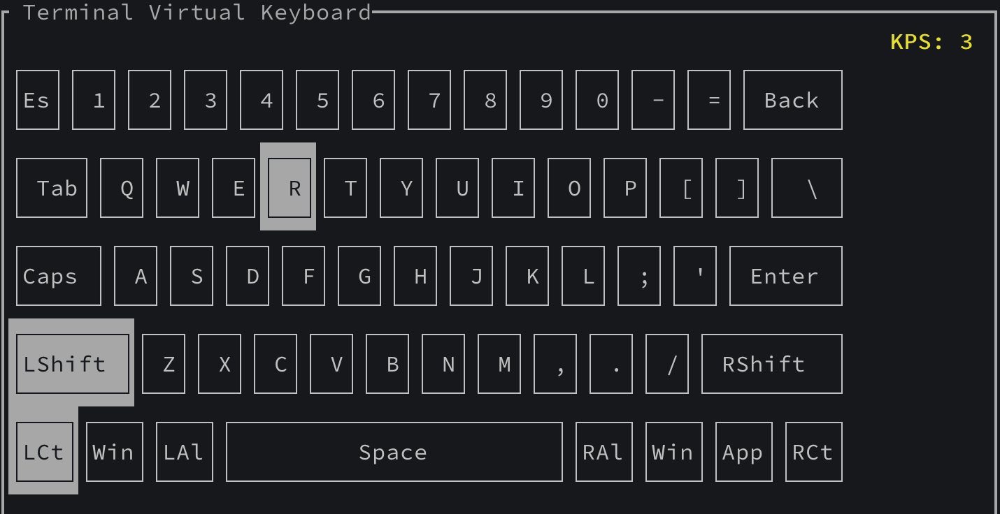

# TerminalVirtualKeyboard

A high-performance, real-time, customizable terminal virtual keyboard written in Rust, powered by RataTUI

## Usage 

```
tvk <tvkl_file>
```

## Snapshot



## TVKL

The tvkl, Terminal Virtual Keyboard Layout, is a format used to represent your keyboard layout which makes customization easlier and more ergonomic <br>

You can check the tvkl grammar here: [tvkl](./tvkl/grammar/tvkl.gram) <br>
There are some examples here: [layouts](./layouts) <br>
